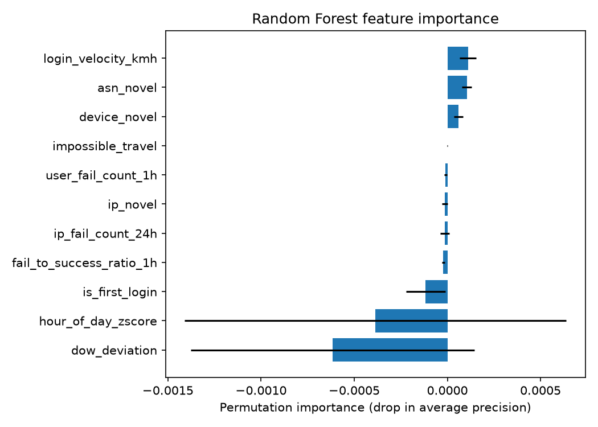

# Anomalock — Model Comparison Report (Phase 2)

## 1. Problem

Password-only authentication can't distinguish a legitimate login from one using stolen-but-valid credentials
(credential stuffing), a slow/low brute-force attempt, or a login from an unfamiliar device/location. This
report compares three approaches to scoring login risk from behavioral signals: a rule-based baseline, an
unsupervised anomaly detector (Isolation Forest), and a supervised classifier (Random Forest).

## 2. Data

[RBA Dataset](https://zenodo.org/record/6782156) (Wiefling et al., CC BY 4.0) — real-world login events from a
large-scale SSO service. We use a reproducible, user-level subsample: **300,003 rows / 74,353 users**. See
[`data/DATA.md`](../data/DATA.md) for full sourcing/subsampling methodology.

**Label**: `Is Account Takeover`, the dataset's confirmed-attack ground truth. Extremely sparse — **141 of
300,003 rows (0.047%)**. `Is Attack IP` (a noisier IP-reputation heuristic, ~8.4% of rows) is used only as an
input feature, never as a label.

**Split**: chronological, cutoff 2020-09-01 (train: Feb–Aug 2020, 162,839 rows / 103 positives; test: Sep
2020–Feb 2021, 137,164 rows / 38 positives). All 141 labeled attacks happen to fall in Feb–Nov 2020, so a
"last few months" holdout would put zero positives in test — the cutoff was chosen to keep a workable number
of positives on both sides, not to flatter results. See [`src/anomalock/models/split.py`](../src/anomalock/models/split.py).

## 3. Methodology

**Features** (5 families, all computed causally — only using each user's/IP's history strictly prior to the
current login; see [`src/anomalock/features/build_features.py`](../src/anomalock/features/build_features.py)
for full rationale per feature):
login velocity (haversine distance / time, via offline GeoNames city/country geocoding), per-user and per-IP
rolling failed-login counts, circular time-of-day z-score + day-of-week deviation, device/IP/ASN novelty, and
fail-to-success ratio.

**Models**:
- **Baseline** — OR of threshold rules on the engineered features (impossible travel, all-three novelty,
  hour z-score > 3, high failure counts). Thresholds set from train-set feature/label means, not tuned on test.
- **Isolation Forest** — unsupervised, trained without labels (as it would be in production, where confirmed
  attack labels are rarely available at training time). `contamination` set to the train-set empirical
  positive rate as a rough prior.
- **Random Forest** — supervised, `class_weight="balanced"` to counter the extreme imbalance.

**Metrics**: precision, recall, and false-positive rate at each model's natural operating point, plus
**recall at a fixed review budget** (top 0.5%/1%/2%/5%/20% riskiest logins flagged) for the two score-based
models. Accuracy is not reported — at 0.05% positive rate, "flag nothing" scores 99.95% accuracy while
catching zero attacks. Recall@budget matters because, unlike the baseline's all-or-nothing rules, a real
review team operates under a fixed capacity (e.g. "we can only step-up-auth 1% of logins"), and score-based
models can be tuned to that budget while a fixed rule set cannot.

## 4. Results

### Natural operating point

| Model | Precision | Recall | False positive rate | Flagged / 137,164 test rows |
|---|---|---|---|---|
| Baseline (rules) | 0.078% | 81.6% | 28.8% | 39,549 |
| Isolation Forest | 0.0% | 0.0% | 0.11% | 147 |
| Random Forest | 0.031% | 21.1% | 19.0% | 26,041 |

### Recall at fixed review budget

| Budget | Isolation Forest recall | Random Forest recall |
|---|---|---|
| 0.5% | 0.0% | 0.0% |
| 1% | 7.9% | 0.0% |
| 2% | 15.8% | 0.0% |
| 5% | 28.9% | 0.0% |
| 20% | 60.5% | 21.1% |

### Permutation importance (Random Forest, scored on average precision)

`login_velocity_kmh`, `asn_novel`, and `device_novel` are the only features with a clearly positive, low-noise
contribution. `hour_of_day_zscore` and `dow_deviation` have huge error bars relative to their mean — with only
38 positives in the test set, permutation importance for these features is not reliably estimated; more data
would be needed to say anything confident about them individually, even though the group-level EDA check
(mean feature value by label, see [`data/DATA.md`](../data/DATA.md) / notebook) showed `hour_of_day_zscore` as
one of the strongest single-feature separators (mean 4.49 for ATO vs. 0.28 for normal logins). Permutation
importance and a raw group-mean comparison are answering slightly different questions, and here they disagree
on ranking — worth flagging rather than picking whichever one looks better.

## 5. Discussion

**Isolation Forest beats Random Forest at every review budget**, which was not the expected outcome — RF is
usually the stronger model when labels exist. Two likely reasons: (1) Random Forest had only 103 positive
examples to learn from, far too few to fit a robust decision boundary in an 11-dimensional space; Isolation
Forest needs no labels and uses the full 162,839-row training set. (2) Roughly two-thirds of the feature
vector is boolean/low-cardinality (novelty flags, small integer counts), which causes Random Forest's
`predict_proba` to collapse onto a handful of discrete values — in this run, **25,960 of 137,164 test rows
(19%) share the exact same predicted probability**, including all 8 of RF's true positives, so at any review
budget below ~19% those true positives are indistinguishable by rank from ~25,952 false ones. This is a
concrete illustration of why supervised models struggle when positive examples are this rare: there simply
isn't enough signal to separate a tied cluster that large.

**The rule-based baseline gets high recall (81.6%) but is operationally useless** — flagging 28.8% of all
login traffic to catch 31 attacks would mean nearly 1 in 3 logins gets step-up authentication. This mirrors a
real failure mode of static-threshold RBA systems: a rule broad enough to catch slow/rare attacks is broad
enough to also fire constantly on normal behavior, especially when (as here) most users have very little
login history to establish a personal baseline against.

**Novelty features are noisier than expected** given the dataset's per-user login volume (median 2 logins/
user — see [`notebooks/01_eda.ipynb`](../notebooks/01_eda.ipynb)). A returning user's *second* login has a
high chance of using a new IP/ASN simply due to residential IP/mobile-carrier churn, not attack behavior. The
baseline's `asn_novel & ip_novel & device_novel` rule alone fires on 24.6% of all test rows for this reason.

**Failed-login features are a weak or inverse signal for this label**, confirming the EDA finding: ATO-linked
users show a *lower* median failure rate than normal users, because these are credential-stuffing attacks
using already-valid stolen passwords, not guessing. They remain useful in principle for the slow/low
brute-force scenario described in the problem statement, but that scenario is not well represented among this
dataset's 141 confirmed-ATO labels.

## 6. Limitations

- **141 positive labels total (103 train / 38 test)** is very little ground truth. Every number above should
  be read with wide, unstated confidence intervals — a handful of different labeled examples could shift
  recall by 10+ percentage points. This is the single biggest limitation of this evaluation.
- **Chronological split cutoff (2020-09-01) was chosen partly to preserve positives in both splits**, not
  purely to mirror a production holdout. A stricter "last N months" split was not usable given how the labels
  are distributed in time (see Section 2 and `split.py`).
- **Geocoding is city/country-level, not IP-level** (~34% of rows get an exact city match, ~66% fall back to
  a country centroid — see `data/DATA.md`), so `login_velocity_kmh` cannot detect travel within a country and
  likely undercounts true impossible-travel cases.
- **No model exceeds the baseline's recall**, and no model is production-ready at its natural operating
  point. This is reported as-is rather than tuned to look better — see the project's own ground rule against
  fabricating results.
- Random Forest's `class_weight="balanced"` distorts its default 0.5 probability threshold into a
  non-meaningful operating point (it flags 19% of traffic); this is why recall@budget, not the default
  `predict()`, is the fairer comparison for this model.
